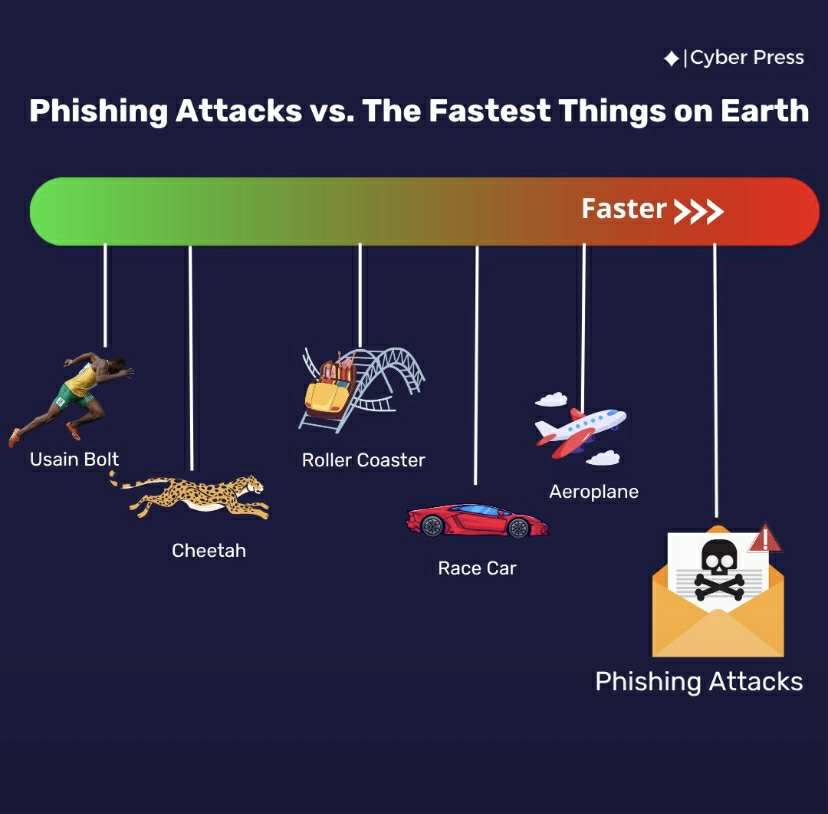
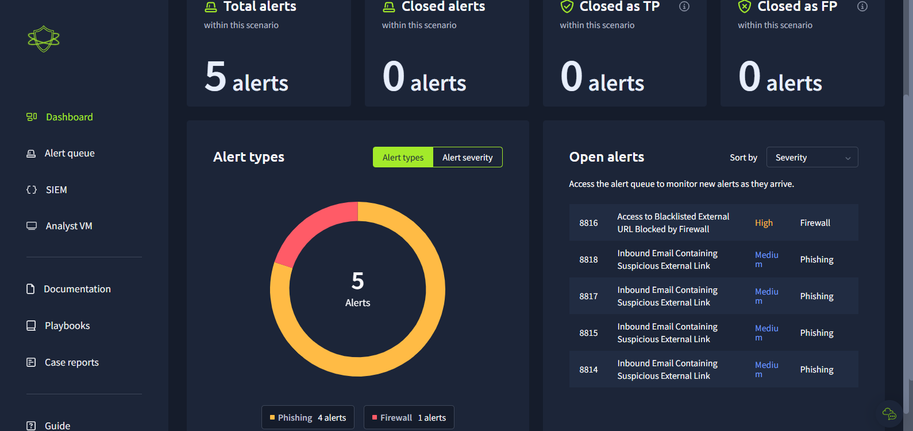

## Phishing Investigation with Splunk 🕵️‍♂️
A hands-on lab simulation on TryHackMe platform,analyzing phishing alerts,investigating suspicious emails and determining true or false positives with case reports for each one of them to secure the system environment.

---

## 💡 Project Summary
I completed a phishing investigation using TryHackMe's Phishing Unfolding simulation room.I analyzed phishing alerts using Splunk,determined whether incidents were true or false positives and documented findings in clear case reports.This lab reinforced my skills for identifying,investigating and responding to phishing attacks.

---
## ✅ What I Did
- Reviewed alerts in a SOC simulation dashboard (5 total: 1 high-severity firewall alert,4 medium-severity phishing alerts).  
- Investigated a high sevirity firewall alert to confirm blocked malicious activity and documented my findings.  
- Analyzed phishing emails,checking sender domains,URLs,malicious links and recipient activity via Splunk logs.  
- Classified alerts as True Positive or False Positive based on investigation results.  
- Created case reports with detailed evidence,reasoning my True/False positives and recommended remediation actions.  
- Proposed security procedures such as blocking malicious domains(firewall rules) and educating employees on phishing risks.

---

## 📸 Screenshots

Credits:Cyber Press

🔎 View Full Lab Walkthrough (Screenshots)

1)My SOC Dashboard with the alerts I have to handle 

)Results

---

## 🛠️ Tools & Technologies
- Splunk:for log analysis and alert investigation  
- SOC Simulator dashboard for alerts and severity levels
   
---

## 🧠 Insights & Lessons Learned

- Practiced investigating phishing emails in a real-world simulation.  
- Reinforced my knowledge on using Splunk to query for IPs,URLs and other useful events that helped me unsterstand more about my alerts.  
- Gained more experience in classifying alerts as True Positive or False Positive with detailed documenting findings and creating case reports for to help my .  
- Gained a better understanding of proactive defenses:need of blocking malicious domains,educating users and responding quickly to alerts based of coruse on their sevirty level.

---

## 🔒 Copyright Notice
All content and visuals in this repository are original and may not be reused without permission.

---

## 🙋‍♂️ Rakip
Cyber Security Professional

---

